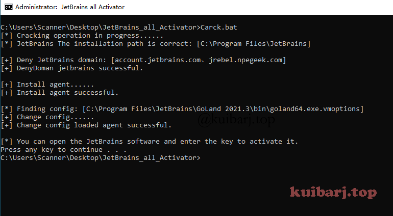
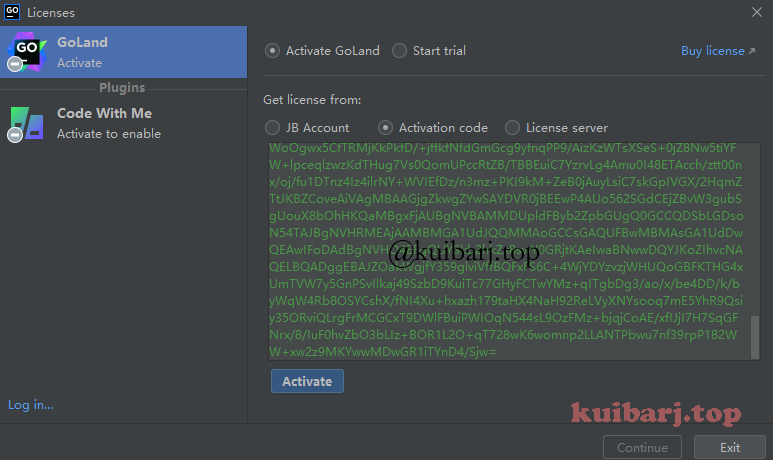
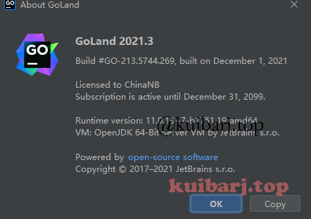

## JetBrains家族产品激活

### 0x01 废话

安装JetBrains系软件后，不要马上打开！不要马上打开！不要马上打开！

1、脚本默认检索的是JetBrains默认安装路径：`C:\Program Files\JetBrains` 

2、安装是自定义路径，需更改 `jbPath` 的值。

3、软件安装路径和脚本放非中文路径。（没试过，理论上应该没影响）

### 0x02 操作

管理员权限运行 `JetBrainsCrack.bat`

打开JetBrains系软件，选择使用激活码激活，激活码在Key.txt。

适用v2021.3及之前的，当然也适用于新版本，理论上全版本可用。

================================================================================================

其中的 `jetbrains-agent.jar` 网上找的，具体链接不记得了。安全性自检。

